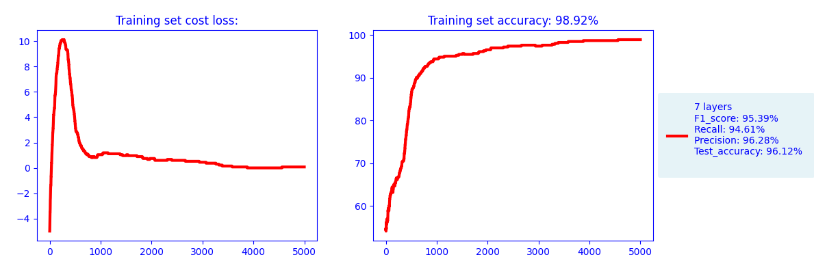

#Multilayer_Perceptron : accuracy 30%
  Machine Learning Neural Network
    Multi hidden layers
    Back Propagation Neural Network
  
  - Data_processing package
    - replace NaN by median
    - replace 'B' and 'M' string by 0 1
    - delete column if too much data missing
  - Forward propagation
    - Initialisation
    - Vectorization
    - Activation
  - Back propagation  
   
#SOFTMAX  

    
    # softmax(z) = exp(zi) / Σj(exp(zj))
 
#FORWARD PROPAGATION

    # First layer
    Z[1] = W[1] x X + b[1]
    A[1] = 1 / (1 + exp(-Z[1]))

    # Second layer
    Z[2] = W[2] x A[1] + b[2]
    A[2] = 1 / (1 + exp(-Z[2]))

    # c layers
    Z[c] = W[c] x A[c - 1] + b[c]
    A[c] = 1 / (1 + exp(-Z[c]))

    # Binary cross-entropy error functionLog loss 
      with epsilon used to avoid overflows 1e-15
    L = (-1 / N) x sum( Ylog(A[2]) + (1 - Y)log(1 - A[2]))
    with Y(n) from n = 1 to n = N

#BACK PROPAGATION
  Trace how the cost function evolves from the last layer model to the first
  
  #Calculation partiale derivative derivative with respect to W[2] && derivative with respect to B[2] 
    Z[1] = W[1].X + b[1]    (n1, n0) x (n0, m) + (n1, 1) // With boradcasting effect (n1, 1) becomes (n1, m) 
    
    ∂Z[2] = (∂L / ∂A[2]) x (∂A[2] / ∂Z[2])
        (∂L / ∂A[2]) = (1 / m) x sum(((-Y / A[2]) + ((1 - y) / (1 - A[2]))))
        (∂L / ∂Z[2]) = A[2] x (1 - A[2])
    
    ∂Z[2] = (1 / m) x sum(A[2] - Y)
    ∂L / ∂W[2] = (1 / m) ∂Z[2] x A[1].T     # with 'T' for Transpose
    ∂L / ∂B[2] = (1 / m) x sum(∂Z[2])
    
    ∂Z[1] = W[2].T x ∂Z[2] x (A[1] x (1 - A[1])) # Multiplication terme a terme C = A * B qui n est pas une multiplication matricielle
    ∂L / ∂W[1] = (1 / m) x ∂Z[1] x X.T
    ∂L / ∂B[1] = (1 / m) x sum(∂Z[1])

    ∂Z[c-1] = W[c].T x ∂Z[c] x (A[c-1] x (1 - A[c-1])) 
    ∂L / ∂W[c] = (1 / m) x ∂Z[c] x A[c-1].T
    ∂L / ∂b[c] = (1 / m) x sum(∂Z[c])

  #F1_Accuracy

    cls for [0, 1]
    true_positives = np.sum((y == cls) & (y_prediction == cls))
    false_positives = np.sum((y != cls) & (y_prediction == cls))
    false_negatives = np.sum((y == cls) & (y_prediction != cls))

    # Calculate precision and recall for the current class
    precision = true_positives / (true_positives + false_positives + 1e-10)
    recall = true_positives / (true_positives + false_negatives + 1e-10)
    f1 = 2 * (precision * recall) / (precision + recall + 1e-10)

  
    
